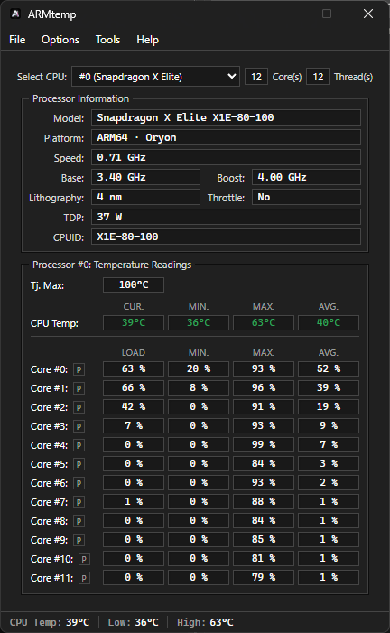
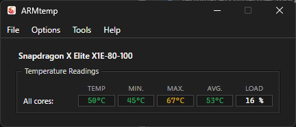
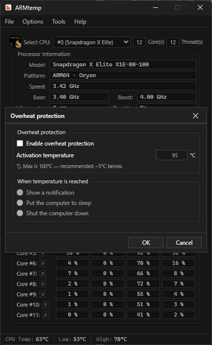
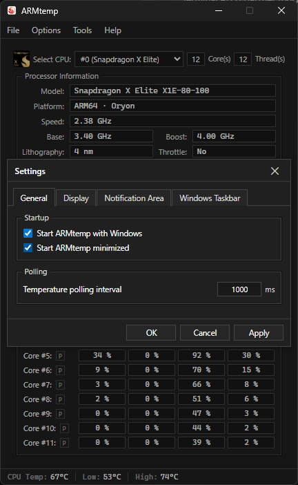
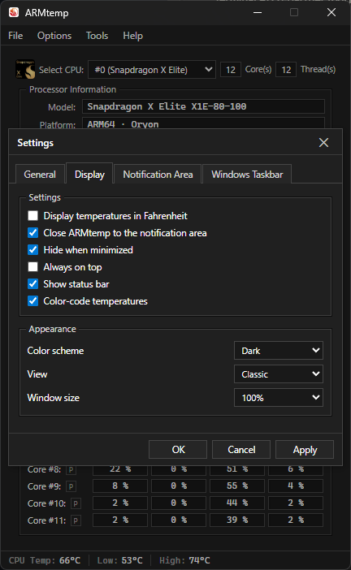
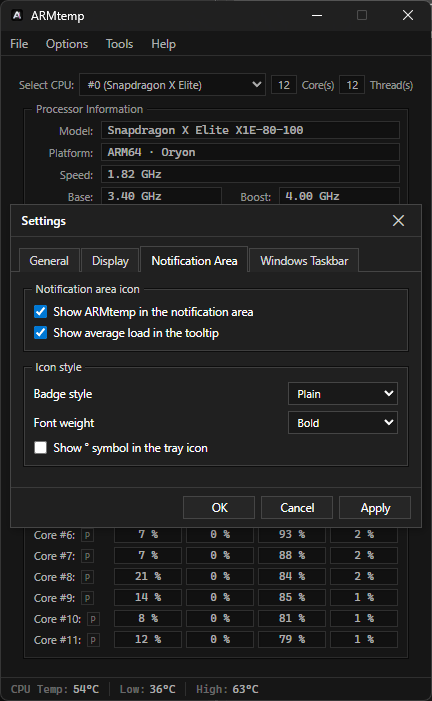
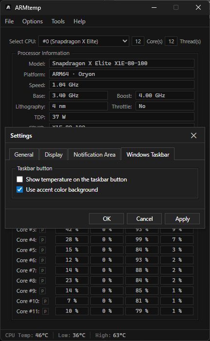

<div align="center">

# ARMtemp

**A native temperature monitor for Snapdragon X / X2 processors on Windows on ARM.**


</div>

ARMtemp reads real ACPI thermal-zone sensors and displays a single honest CPU temperature plus genuinely per-core utilization — recreating the [Core Temp](https://www.alcpu.com/CoreTemp/) experience for the Snapdragon X family (X1/X1P/X1E, X2/X2P/X2E — Qualcomm Oryon). Snapdragon X exposes no per-core temperature sensor, so ARMtemp doesn't pretend to have one: temperature is reported for the CPU as a whole, and per-core rows show real per-core load instead. Built as a small native ARM64 binary (Tauri 2 + Rust + React), with a live system-tray icon, mini mode, and overheat protection.

> This is a from-scratch native app ported from a Claude/Design-Component mockup (`claude-design-output/`), which was a *simulated* Windows-desktop preview. All live data here is **real**; no readings are fabricated. See [`SENSORS.md`](./SENSORS.md) for the full sensor discovery report.

<p align="center">
  
</p>

## Contents

- [Features](#features)
- [Screenshots](#screenshots)
- [How it reads sensors](#how-it-reads-sensors-the-important-part)
- [Build & run](#build--run)
- [Project layout](#project-layout)

---

## Features

- Real telemetry: one CPU temperature via ACPI thermal zones (with session Min/Max/Avg), genuinely per-core load, live CPU speed/identity
- 3 UI layouts — Classic, Cards, Dashboard
- Mini mode — the same window, stripped to the model name, the CPU temperature, and an averaged per-core load row
- Live system-tray icon showing the current CPU temperature, with a right-click menu
- Overheat protection — notify, sleep, or shut down at a configurable threshold
- Close-to-tray, start-with-Windows, °C/°F, dark/light theme
- MSI + NSIS installers that upgrade an existing install in place (see [Updating](#updating))

**Honest limitations (firmware, not by choice):**
- **Per-core temperatures** aren't exposed by any userspace surface on Snapdragon X — the firmware exposes ~17 valid *zone* temperatures, not one per core. Rather than guess which zone maps to which core, ARMtemp reports one CPU temperature (the hottest valid zone) and shows genuinely per-core *load* instead. True per-core temps would need a signed kernel driver or private Surface/Qualcomm SMF IOCTLs.
- **Voltage and package power** aren't exposed; those fields show `—` rather than a fabricated number.

---

## Screenshots

<table>
  <tr>
    <td align="center"><br><sub>Main window (Classic layout)</sub></td>
    <td align="center"><br><sub>Mini mode</sub></td>
    <td align="center"><br><sub>Overheat protection</sub></td>
  </tr>
  <tr>
    <td align="center"><br><sub>Settings — General</sub></td>
    <td align="center"><br><sub>Settings — Display</sub></td>
    <td align="center"><br><sub>Settings — Notification Area</sub></td>
  </tr>
  <tr>
    <td align="center"><br><sub>Settings — Windows Taskbar</sub></td>
    <td align="center"><br><sub>Live tray icon</sub></td>
    <td></td>
  </tr>
</table>

---

## How it reads sensors (the important part)

Reading temperatures on Snapdragon X under Windows is genuinely hard — the standard WMI classes (`MSAcpi_ThermalZoneTemperature`, `Win32_TemperatureProbe`) return **nothing** on this firmware, and LibreHardwareMonitor has no native Oryon support.

ARMtemp's working data source is the **`Thermal Zone Information`** performance-counter object, which exposes ACPI thermal zones (`\_SB.TZxx`). Sentinels/inactive zones (≤ 0 °C) are filtered out; the rest are converted from Kelvin to °C. The hottest valid zone is reported as the single CPU temperature — there is no per-core thermal surface on this firmware, so ARMtemp doesn't attribute a temperature to any individual core; per-core rows show real per-core load instead.

**Implementation note:** ARMtemp reads these counters natively via the Windows **PDH** (Performance Data Helper) API (`pdh.dll`) — no subprocess, no COM/WMI. This also sidesteps the failure the Rust `wmi` crate's COM/`IWbemServices` path hit when called from inside a Tauri process (`WBEM_E_NOT_FOUND`; see [`SENSORS.md`](./SENSORS.md) §7 for that history). A dedicated worker thread owns the PDH query handles and collects once per poll tick (~1.5–2s); the same counters also yield a genuinely *live* CPU frequency, unlike `Win32_Processor.CurrentClockSpeed`, which mirrors the static max on this firmware.

---

## Build & run

**Prerequisites:** Rust (`aarch64-pc-windows-msvc` target), Node.js 20+, on a Windows on ARM machine (or cross-compile target).

```bash
# Install frontend deps
npm install

# Dev mode (hot-reload frontend + native backend)
npm run tauri dev

# Production build -> native ARM64 .exe + MSI/NSIS installers
npm run tauri build
# Output: src-tauri/target/release/armtemp.exe
#         src-tauri/target/release/bundle/{msi,nsis}/
```

Output is a **native ARM64** (`AA64`) executable (~3.8 MB), no emulation.

### Updating

Running a newer MSI or NSIS installer over an existing install **upgrades it in place** — no need to uninstall first. This works because the bundle identifier and product name stay constant across releases; don't mix installer families (installing the MSI over an NSIS-installed copy, or vice versa, won't detect the prior install). There is no in-app auto-updater yet — updates are manual, by re-running an installer.

Launching a second copy of the **same version** while one is already running shows an "already running" message instead of opening a duplicate window; a **different** version (e.g. a dev build) is allowed to run alongside it.

---

## Project layout

```
armtemp/
├── claude-design-output/      # The original Claude mockup (simulated, HTML/JS) — reference only
├── docs/screenshots/          # README screenshots
├── src/                       # React + TypeScript frontend
│   ├── app/                   # types, theme tokens, hooks (settings, sensors)
│   ├── components/            # MenuBar, ProcessorInfo, layouts/, SettingsDialog, MiniMode…
│   └── styles.css             # Design tokens ported from the mockup
├── src-tauri/                 # Rust + Tauri backend
│   └── src/
│       ├── lib.rs             # App wiring, poll loop, tray, IPC commands, single-instance guard
│       └── sensors/           # Real telemetry: pdh.rs (primary), chips.rs, tray.rs, tray_render.rs, types.rs
├── tools/                     # Sensor probe scripts (Phase 0 artifacts) + icon generator
└── SENSORS.md                 # Full sensor discovery report (what works, what doesn't, why)
```

---

*ARMtemp is an independent monitoring utility and is not affiliated with any silicon vendor.*
